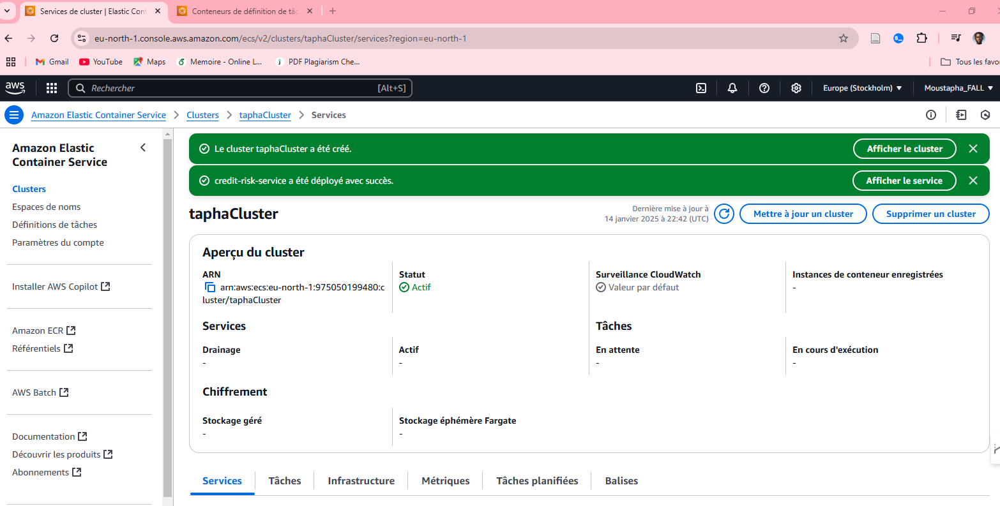

# Credit_Risk_Evaluation

## Description

This project aims to develop and deploy a machine learning model for credit risk evaluation. The main objectives include:

1. Building a robust credit risk prediction model using historical data to assess the likelihood of credit repayment.
2. Serialising the trained model in `.pkl` format for reuse and integration into production.
3. Creating a RESTful API with Flask to enable interaction with the model, providing predictions based on user inputs.
4. Containerising the application with Docker and pushing the image to Docker Hub for ease of deployment.
5. Deploying the application on AWS for scalability and accessibility.

The dataset used is the German Credit Data, available on Kaggle: [https://www.kaggle.com/code/mathchi/credit-risk-evaluation/input?select=german_credit_data.csv](https://www.kaggle.com/code/mathchi/credit-risk-evaluation/input?select=german_credit_data.csv)

## Installation

### Prerequisites

Ensure you have the following installed:

- Python (>=3.12)
- Docker
- AWS CLI
- Flask
- Required Python libraries (listed in `requirements.txt`)

### Steps

1. Clone the repository:

   ```bash
   git clone https://github.com/your-repo-name.git
   cd credit-risk-evaluation
   ```

2. Install dependencies:

   ```bash
   pip install -r requirements.txt
   ```

3. Run the Flask application locally :

   ```bash
   python main.py
   ```

4. Build the Docker image:

   ```bash
   docker build -t credit-risk-api .
   ```

5. Push the Docker image to Docker Hub:

   ```bash
   docker tag credit-risk-api your_repo_name (e.g. moustapha2024)/credit-risk-repo
   docker push your_repo_name/credit-risk-repo
   ```

6. Deploy the application on AWS ECS (refer to the deployment section for details).

## Project Organisation

```
├── LICENSE            <- Open-source license if one is chosen
├── README.md          <- The top-level README for developers using this project
├── data
│   ├── processed      <- The final, canonical data sets for modeling
│   └── raw            <- The original, immutable data dump
│
├── models             <- Trained and serialized models, model predictions, or model summaries
│   └── rf_model_0_1.pkl
│
├── references         <- Data dictionaries, manuals, and all other explanatory materials
│
├── images             <- Contains captured images about applications
│   ├── images_deploiement        <- Screenshots of deployment processes and results
│   └── images_web_interface      <- Screenshots of the web interface
│
├── requirements.txt   <- The requirements file for reproducing the analysis environment, e.g.
│                         generated with `pip freeze > requirements.txt`
│
└── src                         <- Source code for this project
    ├── modeling                
    │   ├── __init__.py         
    │   ├── credit_risk.ipynb   <- Data mining notebook for credit risk prediction          
    └── app                    <- Flask application source files
```

## Deployment

### Docker Deployment

1. Build and tag the Docker image:
   ```bash
   docker build -t credit-risk-api .
   docker tag credit-risk-api moustapha2024/credit-risk-repo
   ```
2. Push the image to Docker Hub:
   ```bash
   docker push moustapha2024/credit-risk-repo
   ```

### AWS Deployment

1. Create an ECS Cluster using the AWS Management Console.
2. Define a Task Definition and Service to run the container.
3. Pull the Docker image from Docker Hub and deploy it to AWS ECS.

Refer to the image below for a successful deployment example:

> Note: Due to AWS costs, the link for testing is unavailable.



## Perspectives

- Make inferences
- Recover user logs and re-train models
- Separe model deployement using aws S3 for more scalability

## Contributing  🤝

We welcome contributions to this project! To contribute:

1. Fork the repository.
2. Create a new branch (`feature/your-feature-name`).
3. Commit your changes and push them to your forked repository.
4. Open a pull request, detailing the changes and their purpose.

## References

- Deployment of Machine Learning Models with Flask, Docker, and GCP: [https://www.youtube.com/watch?v=xaI03GSya0g&t=91s&ab_channel=LeCoinStat](https://www.youtube.com/watch?v=xaI03GSya0g&t=91s&ab_channel=LeCoinStat)
- How to Deploy ML Solutions with FastAPI, Docker, & AWS: [https://www.youtube.com/watch?v=pJ_nCklQ65w&t=1440s&ab_channel=ShawTalebi](https://www.youtube.com/watch?v=pJ_nCklQ65w&t=1440s&ab_channel=ShawTalebi)

---
